# 🎭 SISTEMA DE CLASES - DISEÑO COMPLETO

**Documento:** Especificación técnica para implementación completa del sistema de clases  
**Versión:** 1.0  
**Fecha:** 19 de febrero de 2026  
**Estado:** Diseño aprobado - Pendiente implementación Tier 2+

---

## 📋 ÍNDICE

1. [Estado Actual](#estado-actual)
2. [Arquitectura del Sistema](#arquitectura)
3. [Clases Implementadas](#clases-implementadas)
4. [Clases Por Implementar](#clases-por-implementar)
5. [Sistema de Contadores](#sistema-de-contadores)
6. [Skills y Habilidades](#skills-y-habilidades)
7. [Sistema de Desbloqueo](#sistema-de-desbloqueo)
8. [Balanceo](#balanceo)

---

## ✅ ESTADO ACTUAL

### Componentes Activos
- ✅ **ClassUnlockDatabase.cs** — Requisitos de desbloqueo (Tier 1 + 7 ocultas)
- ✅ **ActionTrackerService.cs** — Tracking de acciones del jugador
- ✅ **ClassBonusService.cs** — Cálculo de bonos por clase activa
- ✅ **ClassesCommand.cs** — Comando `/clases` para ver/cambiar clase
- ✅ **RpgPlayer.ActiveClassId** — Clase activa del jugador
- ✅ **RpgPlayer.UnlockedClasses** — Lista de clases desbloqueadas
- ✅ **RpgPlayer.ActionCounters** — Dictionary<string, int> de contadores

### Clases Operativas
| Tier | Cantidad | Estado |
|------|----------|--------|
| Tier 0 (Base) | 1 | ✅ Implementado |
| Tier 1 (Básicas) | 4 | ✅ Implementado |
| Tier 2 (Avanzadas) | 0 | ⏸️ Diseñado |
| Tier 3 (Maestras) | 0 | ⏸️ Diseñado |
| Ocultas (Hidden) | 7 | ✅ Implementado |
| **TOTAL ACTIVO** | **12** | — |

---

## 🏗️ ARQUITECTURA DEL SISTEMA

### Flujo de Desbloqueo

```mermaid
graph TD
    A[Jugador realiza acción] --> B[ActionTrackerService.TrackAction]
    B --> C{¿Cumple requisitos?}
    C -->|Sí| D[Añade a UnlockedClasses]
    C -->|No| E[Incrementa contador]
    D --> F[Notifica al jugador]
    E --> B
```



### Estructura de Datos

```csharp
// RpgPlayer.cs
public class RpgPlayer
{
    // Sistema de clases (Fase 4)
    public CharacterClass Class { get; set; } = CharacterClass.Adventurer;
    public string ActiveClassId { get; set; } = "adventurer";
    public List<string> UnlockedClasses { get; set; } = new List<string> { "adventurer" };
    
    // Tracking de acciones
    public Dictionary<string, int> ActionCounters { get; set; } = new Dictionary<string, int>();
    
    // Skills desbloqueadas por clase
    public Dictionary<string, List<string>> UnlockedSkills { get; set; } = new Dictionary<string, List<string>>();
}
```

### Clases Clave

```
├── Models/
│   ├── RpgPlayer.cs (CharacterClass enum, propiedades)
│   └── ClassInfo.cs (Datos descriptivos de clases)
├── Services/
│   ├── ActionTrackerService.cs (Tracking + checks)
│   ├── ClassUnlockDatabase.cs (Requisitos)
│   ├── ClassBonusService.cs (Bonos stats)
│   └── SkillDatabase.cs (PENDIENTE - Skills por clase)
└── Commands/
    └── ClassesCommand.cs (UI + cambio de clase)
```

---

## 📊 CLASES IMPLEMENTADAS (12)

### Tier 0: Base

#### Adventurer (aventurero)
```csharp
ClassId: "adventurer"
Enum: CharacterClass.Adventurer
Stats: STR 10, INT 10, DEX 10, CON 10, WIS 10, CHA 10
HP: 100 | Mana: 0 | Energy: 50
Bonos: Ninguno (baseline)
Skills: Ninguna especial
Requisitos: Ninguno (clase inicial)
```

---

### Tier 1: Básicas (4)

#### Warrior (warrior)
```csharp
ClassId: "warrior"
Enum: CharacterClass.Warrior
Stats Base: STR +4, CON +2, DEX -2
Bonos Activos:
  - PhysicalAttack: +20%
  - MaxHP: +15%
  - StaminaCost: -10%
Skills Desbloqueables:
  - PowerStrike (Lv5): 150% dmg físico, -20 stamina
  - Rage (Lv10): +30% ATK 3 turnos, -15 HP
Contadores Asociados:
  - physical_attack: Incrementa cada ataque normal
  - defend_action: Incrementa al defender
Requisitos Desbloqueo:
  - physical_attack >= 100
```

#### Mage (mage)
```csharp
ClassId: "mage"
Enum: CharacterClass.Mage
Stats Base: INT +5, WIS +2, CON -3
Bonos Activos:
  - MagicalAttack: +25%
  - MaxMana: +20%
  - ManaRegen: +15%
Skills Desbloqueables:
  - Fireball (Lv5): 3x INT fire dmg, -15 mana
  - IceShard (Lv8): 2.5x INT ice dmg + 30% slow, -12 mana
  - LightningBolt (Lv12): 4x INT lightning dmg + 20% stun, -20 mana
Contadores Asociados:
  - magic_cast: Incrementa cada hechizo lanzado
  - mana_spent: Acumula mana total gastado
Requisitos Desbloqueo:
  - magic_cast >= 100
```

#### Rogue (rogue)
```csharp
ClassId: "rogue"
Enum: CharacterClass.Rogue
Stats Base: DEX +5, STR 0, CHA 0
Bonos Activos:
  - CritChance: +30%
  - Evasion: +25%
  - Speed: +20%
Skills Desbloqueables:
  - Backstab (Lv5): x3 dmg si enemigo >80% HP, -10 stamina
  - ShadowStep (Lv10): Evasión garantizada próx. turno, -15 stamina
  - PoisonBlade (Lv15): 150% dmg + poison 3 turnos, -12 stamina
Contadores Asociados:
  - critical_hit: Incrementa cada crítico exitoso
  - dodge_success: Incrementa cada esquive exitoso
Requisitos Desbloqueo:
  - critical_hit >= 50
```

#### Cleric (cleric)
```csharp
ClassId: "cleric"
Enum: CharacterClass.Cleric
Stats Base: WIS +5, INT 0, CHA +2
Bonos Activos:
  - HealingPower: +40%
  - AllyMaxHP: +10%
  - DebuffResist: +20%
Skills Desbloqueables:
  - Heal (Lv3): Restaura 3x WIS HP, -10 mana
  - DivineShield (Lv8): +50% DEF a aliado 3 turnos, -15 mana
  - Resurrection (Lv20): Revive aliado 50% HP, -50 mana
Contadores Asociados:
  - heal_cast: Incrementa cada curación
  - hp_healed: Acumula HP total curado
Requisitos Desbloqueo:
  - heal_cast >= 50
  - hp_healed >= 1000
```

---

### Clases Ocultas (7)

#### Blood Knight (blood_knight)
```csharp
ClassId: "blood_knight"
Enum: CharacterClass.BloodKnight (PENDIENTE añadir al enum)
Rareza: Legendary
Stats Base: STR +8, CON +5, WIS -2
Bonos Activos:
  - PhysicalAttack: +50%
  - LifestealPerKill: 10% HP
  - BerserkMode: +5% ATK por cada 10% HP perdido
  - ImmuneBleed: true
Skills Especiales:
  - BloodStrike (Lv10): 300% dmg, cuesta 20% HP, -10 stamina
  - CrimsonAura (Lv15): +50% ATK, +20% lifesteal 5 turnos, -30 HP
  - BloodSacrifice (Lv25): Sacrifica 50% HP → mana 100% + ATK x2
Contadores Asociados:
  - physical_attack: >= 1000
  - damage_taken: >= 20000
  - total_kills: >= 500
Requisitos Desbloqueo:
  - physical_attack >= 1000
  - damage_taken >= 20000
  - total_kills >= 500
```

#### Time Mage / Chronomancer (chronomancer)
```csharp
ClassId: "chronomancer"
Enum: CharacterClass.Chronomancer (PENDIENTE)
Rareza: Mythic
Stats Base: INT +10, WIS +8, DEX +2
Bonos Activos:
  - MagicalAttack: +60%
  - DoubleTurnChance: 20%
  - ImmuneStun: true
  - MaxMana: +50%
Skills Especiales:
  - TimeStop (Lv20): Congela enemigo 2 turnos, -80 mana
  - Haste (Lv15): +100% velocidad 4 turnos, -40 mana
  - Rewind (Lv30): Deshace último turno, -100 mana
Contadores Asociados:
  - magic_cast: >= 2000
  - mana_spent: >= 1000000
  - combo_8x: >= 100
Requisitos Desbloqueo:
  - magic_cast >= 2000
  - mana_spent >= 1000000
  - combo_8x >= 100
```

#### Shadow Assassin (shadow_assassin)
```csharp
ClassId: "shadow_assassin"
Enum: CharacterClass.ShadowAssassin (PENDIENTE)
Rareza: Legendary
Stats Base: DEX +10, STR +5, INT 0
Bonos Activos:
  - CritChance: +80%
  - Evasion: +50%
  - InvisibleAfterKill: 1 turno
  - BackstabDamage: +100%
Skills Especiales:
  - DeathMark (Lv12): Instakill si <30% HP, sino 400% dmg, -25 stamina
  - ShadowClone (Lv18): Clon 50% stats 3 turnos, -30 stamina
  - Vanish (Lv25): Invisibilidad 2 turnos + cura 30% HP, -40 stamina
Contadores Asociados:
  - critical_hit: >= 1500
  - dodge_success: >= 1000
  - stealth_kill: >= 800
Requisitos Desbloqueo:
  - critical_hit >= 1500
  - dodge_success >= 1000
  - stealth_kill >= 800
```

#### Divine Healer (divine_healer)
```csharp
ClassId: "divine_healer"
Enum: CharacterClass.DivineHealer (PENDIENTE)
Rareza: Epic
Stats Base: WIS +8, INT +5, CHA +5
Bonos Activos:
  - HealingPower: +100%
  - AoEHeal: 20% a aliados cercanos
  - RemoveDebuffs: Al curar
  - PartyMaxHP: +30%
Skills Especiales:
  - MassHeal (Lv10): Cura 5x WIS a todos, -35 mana
  - GuardianAngel (Lv20): Aliado sobrevive fatal hit con 1 HP, -50 mana
  - HolySanctuary (Lv30): Party inmune 1 turno, -80 mana
Contadores Asociados:
  - heal_cast: >= 500
  - hp_healed: >= 50000
  - resurrect: >= 50
Requisitos Desbloqueo:
  - heal_cast >= 500
  - hp_healed >= 50000
  - resurrect >= 50
```

#### Dragon Knight (dragon_knight)
```csharp
ClassId: "dragon_knight"
Enum: CharacterClass.DragonKnight (PENDIENTE)
Rareza: Mythic
Stats Base: STR +12, CON +8, CHA +5
Bonos Activos:
  - DragonSlayerBonus: +100%
  - FireResist: +50%
  - CanMountWyvern: +30% stats
  - MaxHP: +40%
  - MaxDEF: +40%
Skills Especiales:
  - DragonBreath (Lv15): 500 fire AoE, -40 stamina
  - DragonScales (Lv20): +100% DEF, fire immune 5 turnos, -30 stamina
  - WyvernStrike (Lv35): 800% dmg + knockback, -60 stamina
Contadores Asociados:
  - dragon_kill: >= 5
  - physical_attack: >= 2000
  - damage_taken: >= 10000
Requisitos Desbloqueo:
  - dragon_kill >= 5
  - physical_attack >= 2000
  - damage_taken >= 10000
```

#### Archmage (archmage)
```csharp
ClassId: "archmage"
Enum: CharacterClass.Archmage (PENDIENTE)
Rareza: Legendary
Stats Base: INT +15, WIS +10, DEX 0
Bonos Activos:
  - MagicalAttack: +150%
  - DualCast: Puede lanzar 2 hechizos/turno
  - ManaCostReduction: -50%
  - MaxMana: +100%
Skills Especiales:
  - MeteorStorm (Lv25): 10x INT AoE, -60 mana
  - ArcaneMastery (Lv30): Próximos 3 hechizos 0 mana, -80 mana
  - TimeWarp (Lv40): Reset CDs todas skills, -120 mana
Contadores Asociados:
  - magic_cast: >= 5000
  - mana_spent: >= 3000000
  - combo_10x: >= 500
Requisitos Desbloqueo:
  - magic_cast >= 5000
  - mana_spent >= 3000000
  - combo_10x >= 500
```

#### Void Walker (void_walker)
```csharp
ClassId: "void_walker"
Enum: CharacterClass.VoidWalker (PENDIENTE)
Rareza: Transcendent
Stats Base: INT +18, WIS +12, CHA +8
Bonos Activos:
  - VoidDamage: +200%
  - DarkDamage: +200%
  - ManaAbsorb: 50% dmg mágico recibido → mana
  - CanBanish: Remove enemigo 3 turnos
  - ImmuneFear: true
  - ImmuneCharm: true
Skills Especiales:
  - VoidRift (Lv30): 1500 void dmg + silence 4 turnos, -100 mana
  - DarkDimension (Lv35): Banish enemigo (instakill <20% HP), -150 mana
  - Singularity (Lv50): AoE masivo (instakill <40% HP), -200 mana
Contadores Asociados:
  - dark_magic: >= 10000
  - summon_void: >= 5000
  - enemy_fear: >= 1000
Requisitos Desbloqueo:
  - dark_magic >= 10000
  - summon_void >= 5000
  - enemy_fear >= 1000
```

---

## 🔮 CLASES POR IMPLEMENTAR

### Tier 2: Avanzadas (12 clases)

#### RAMA WARRIOR

##### Paladin (paladin)
```csharp
ClassId: "paladin"
Enum: CharacterClass.Paladin (existente pero no funcional)
Rareza: Epic
Parent: Warrior
Stats Base: STR +6, CON +5, WIS +4, CHA +3
Bonos:
  - PhysicalAttack: +30%
  - MaxHP: +25%
  - Lifesteal: 10% en ataques
  - DarkResist: +40%
  - PartyAura: +10% DEF
Skills:
  - HolyStrike (Lv12): 250% dmg + cura self 40%, -20 stamina
  - DivineJudgment (Lv18): 400% vs undead/demon, -30 stamina
  - AuraOfProtection (Lv25): Party +50% DEF 4 turnos, -40 mana
Contadores:
  - physical_attack: >= 500
  - defend_action: >= 300
  - hp_healed: >= 2000
Requisitos:
  - Level >= 10
  - RequiredClasses: [Warrior]
  - physical_attack >= 500
  - defend_action >= 300
  - hp_healed >= 2000
```

##### Berserker (berserker)
```csharp
ClassId: "berserker"
Enum: CharacterClass.Berserker (existente)
Rareza: Epic
Parent: Warrior
Stats Base: STR +10, CON +6, DEX -4, WIS -5
Bonos:
  - PhysicalAttack: +70%
  - LowHPBonus: +50% ATK si HP <50%, +100% si <20%
  - MaxDEF: -20%
  - ImmuneFear: true
Skills:
  - Frenzy (Lv12): +100% ATK, -50% DEF 5 turnos, -25 HP
  - RecklessCharge (Lv18): 500% dmg, recibe 50% recoil, -35 stamina
  - LastStand (Lv28): Si HP <10%, +300% ATK hasta fin, -60 stamina
Contadores:
  - physical_attack: >= 800
  - critical_hit: >= 200
  - damage_taken: >= 5000
Requisitos:
  - Level >= 20
  - RequiredClasses: [Warrior]
  - physical_attack >= 800
  - critical_hit >= 200
  - damage_taken >= 5000
```

##### Dual Blade (dual_blade)
```csharp
ClassId: "dual_blade"
Enum: CharacterClass.DualBlade (PENDIENTE añadir)
Rareza: Epic
Parent: Warrior + Rogue hybrid
Stats Base: STR +4, DEX +8, CON 0
Bonos:
  - DualWield: Ataca 2 veces/turno (50% dmg c/u)
  - Speed: +40%
  - Evasion: +30%
  - CritChance: +25%
Skills:
  - TwinStrike (Lv12): 4 ataques x80% dmg, -25 stamina
  - BladeDance (Lv18): 6 ataques x60% + evasion garantizada, -35 stamina
  - CrossSlash (Lv25): 2 ataques x300% simultáneos, -40 stamina
Contadores:
  - physical_attack: >= 600
  - dodge_success: >= 400
  - dual_wield_attack: >= 150
Requisitos:
  - Level >= 15
  - RequiredClasses: [Warrior] OR [Rogue]
  - physical_attack >= 600
  - dodge_success >= 400
  - dual_wield_attack >= 150
```

#### RAMA MAGE

##### Pyromancer (pyromancer)
```csharp
ClassId: "pyromancer"
Enum: CharacterClass.Pyromancer (PENDIENTE)
Rareza: Epic
Parent: Mage
Stats Base: INT +8, WIS +2, DEX 0
Bonos:
  - FireDamage: +80%
  - BurnedEnemyBonus: +50% dmg a enemigos quemados
  - FireImmune: true
  - MaxMana: +30%
Skills:
  - Inferno (Lv12): 400% fire AoE + burn 5 turnos, -40 mana
  - Pyroblast (Lv18): 600% fire single, -50 mana
  - PhoenixForm (Lv25): Revive con 50% HP si muere (1 uso), -80 mana
Contadores:
  - magic_cast: >= 500
  - fire_spell: >= 300
  - mana_spent: >= 5000
Requisitos:
  - Level >= 10
  - RequiredClasses: [Mage]
  - magic_cast >= 500
  - fire_spell >= 300
  - mana_spent >= 5000
```

##### Cryomancer (cryomancer)
```csharp
ClassId: "cryomancer"
Enum: CharacterClass.Cryomancer (PENDIENTE)
Rareza: Epic
Parent: Mage
Stats Base: INT +8, WIS +3, CON +1
Bonos:
  - IceDamage: +70%
  - FrozenEnemyBonus: +100% dmg a congelados
  - IceImmune: true
  - FreezeChance: 40%
Skills:
  - Blizzard (Lv12): 350% ice AoE + 60% slow 4 turnos, -35 mana
  - IcePrison (Lv18): Freeze enemigo 3 turnos (instakill si hit), -45 mana
  - AbsoluteZero (Lv28): 800% dmg + freeze campo 2 turnos, -80 mana
Contadores:
  - magic_cast: >= 500
  - ice_spell: >= 300
  - enemy_frozen: >= 50
Requisitos:
  - Level >= 10
  - RequiredClasses: [Mage]
  - magic_cast >= 500
  - ice_spell >= 300
  - enemy_frozen >= 50
```

##### Stormmage (stormmage)
```csharp
ClassId: "stormmage"
Enum: CharacterClass.Stormmage (PENDIENTE)
Rareza: Epic
Parent: Mage
Stats Base: INT +8, DEX +4, WIS +1
Bonos:
  - LightningDamage: +75%
  - ChainLightning: Salta a 2 enemigos
  - Speed: +50%
  - StunChance: 35%
Skills:
  - ChainLightning (Lv12): 300% dmg salta 4 veces, -30 mana
  - ThunderStrike (Lv18): 500% + stun garantizado 2 turnos, -45 mana
  - StormRage (Lv25): AoE auto ataca 3 turnos, -70 mana
Contadores:
  - magic_cast: >= 500
  - lightning_spell: >= 300
  - enemy_stunned: >= 40
Requisitos:
  - Level >= 10
  - RequiredClasses: [Mage]
  - magic_cast >= 500
  - lightning_spell >= 300
  - enemy_stunned >= 40
```

#### RAMA ROGUE

##### Assassin (assassin)
```csharp
ClassId: "assassin"
Enum: CharacterClass.Assassin (existente)
Rareza: Epic
Parent: Rogue
Stats Base: DEX +8, STR +4, INT 0
Bonos:
  - CritChance: +100%
  - BackstabDamage: +60%
  - Evasion: +40%
  - Instakill: Si enemigo <15% HP
Skills:
  - Execute (Lv12): Instakill si <25% HP, sino 400% dmg, -30 stamina
  - SilentKill (Lv18): 500% + no alerta enemigos, -35 stamina
  - MarkOfDeath (Lv25): Próx. crítico = instakill, -50 stamina
Contadores:
  - critical_hit: >= 400
  - dodge_success: >= 300
  - stealth_kill: >= 150
Requisitos:
  - Level >= 20
  - RequiredClasses: [Rogue]
  - critical_hit >= 400
  - dodge_success >= 300
  - stealth_kill >= 150
```

##### Trickster (trickster)
```csharp
ClassId: "trickster"
Enum: CharacterClass.Trickster (PENDIENTE)
Rareza: Epic
Parent: Rogue
Stats Base: DEX +6, CHA +6, INT +2
Bonos:
  - Evasion: +50%
  - StealChance: 20%
  - GoldBonus: +30%
  - ConfusionAura: Enemigos atacan aliados
Skills:
  - Decoy (Lv12): Señuelo atrae ataques 3 turnos, -20 stamina
  - Pickpocket (Lv15): Roba ítem + enemigo pierde turno, -15 stamina
  - Illusion (Lv22): 3 clones x30% dmg c/u, -40 mana
Contadores:
  - dodge_success: >= 500
  - steal_success: >= 200
  - deception: >= 100
Requisitos:
  - Level >= 15
  - RequiredClasses: [Rogue]
  - dodge_success >= 500
  - steal_success >= 200
  - deception >= 100
```

##### Ranger (ranger)
```csharp
ClassId: "ranger"
Enum: CharacterClass.Ranger (existente)
Rareza: Epic
Parent: Rogue
Stats Base: DEX +7, WIS +4, STR +1
Bonos:
  - RangedDamage: +60%
  - NoStaminaBow: Arco no consume stamina
  - BeastSlayer: +50% vs bestias
  - BacklineAttack: Puede atacar desde retaguardia
Skills:
  - PiercingArrow (Lv12): Atraviesa línea de enemigos, -20 stamina
  - ExplosiveShot (Lv18): 350% AoE + knockback, -30 stamina
  - Volley (Lv25): 10 flechas x100% aleatorias, -45 stamina
Contadores:
  - ranged_attack: >= 500
  - beast_kill: >= 200
  - headshot: >= 150
Requisitos:
  - Level >= 10
  - RequiredClasses: [Rogue]
  - ranged_attack >= 500
  - beast_kill >= 200
  - headshot >= 150
```

#### RAMA CLERIC

##### High Priest (high_priest)
```csharp
ClassId: "high_priest"
Enum: CharacterClass.HighPriest (PENDIENTE)
Rareza: Epic
Parent: Cleric
Stats Base: WIS +8, INT +5, CHA +4
Bonos:
  - HealingPower: +120%
  - ResurrectCostReduction: -50%
  - BuffPotency: +50%
  - PartyHPRegen: +15%/turno
Skills:
  - GreaterHeal (Lv12): Cura 8x WIS + remove debuffs, -35 mana
  - DivineBlessing (Lv18): Party +50% stats 5 turnos, -50 mana
  - Miracle (Lv30): Revive todos con 100% HP, -150 mana (1/día)
Contadores:
  - heal_cast: >= 300
  - hp_healed: >= 10000
  - resurrect: >= 50
Requisitos:
  - Level >= 15
  - RequiredClasses: [Cleric]
  - heal_cast >= 300
  - hp_healed >= 10000
  - resurrect >= 50
```

##### Guardian (guardian)
```csharp
ClassId: "guardian"
Enum: CharacterClass.Guardian (PENDIENTE)
Rareza: Epic
Parent: Cleric + Warrior hybrid
Stats Base: CON +8, WIS +5, STR +3
Bonos:
  - MaxHP: +60%
  - MaxDEF: +60%
  - DamageAbsorb: 30% del dmg a aliados
  - ThreatGen: +50%
  - BlockHeal: 20% HP al bloquear
Skills:
  - ShieldWall (Lv12): +200% DEF, protege aliado, -25 stamina
  - Taunt (Lv15): Fuerza ataque solo a ti 3 turnos, -20 mana
  - Sacrifice (Lv25): TODO dmg party → ti 2 turnos, -60 mana
Contadores:
  - defend_action: >= 500
  - damage_blocked: >= 10000
  - protect_ally: >= 200
Requisitos:
  - Level >= 15
  - RequiredClasses: [Cleric] OR [Warrior]
  - defend_action >= 500
  - damage_blocked >= 10000
  - protect_ally >= 200
```

##### Oracle (oracle)
```csharp
ClassId: "oracle"
Enum: CharacterClass.Oracle (PENDIENTE)
Rareza: Epic
Parent: Cleric
Stats Base: WIS +7, INT +6, CHA +4
Bonos:
  - HealingPower: +80%
  - Foresight: Ve próximo ataque enemigo
  - BuffDebuffPotency: +40%
  - LootPrediction: Puede predecir drops
Skills:
  - Foresight (Lv12): Revela próximos 3 turnos, -30 mana
  - FateManipulation (Lv18): Cambia outcome último turno, -50 mana
  - Prophecy (Lv28): Garantiza drop raro próximo, -80 mana
Contadores:
  - heal_cast: >= 200
  - buff_cast: >= 300
  - predict_success: >= 100
Requisitos:
  - Level >= 18
  - RequiredClasses: [Cleric]
  - heal_cast >= 200
  - buff_cast >= 300
  - predict_success >= 100
```

---

### Tier 3: Maestras (4 base + expansiones)

#### Necromancer (necromancer)
```csharp
ClassId: "necromancer"
Enum: CharacterClass.Necromancer (existente)
Rareza: Legendary
Parent: Mage + Dark Magic
Stats Base: INT +12, WIS +8, CHA 0
Bonos:
  - DarkDamage: +150%
  - CanReviveEnemies: Como minions
  - SummonSlots: +8
  - ImmunePoisonCurse: true
Skills:
  - RaiseDead (Lv20): Revive enemigo como minion permanente, -60 mana
  - DeathCoil (Lv25): 600% dark + cura 100% del dmg, -50 mana
  - ArmyOfUndead (Lv35): 10 skeletons 10 turnos, -100 mana
Contadores:
  - dark_magic: >= 1000
  - summon_undead: >= 800
  - enemy_cursed: >= 500
Requisitos:
  - Level >= 30
  - RequiredClasses: [Mage, Warlock]
  - dark_magic >= 1000
  - summon_undead >= 800
  - enemy_cursed >= 500
```

#### Elemental Sage (elemental_sage)
```csharp
ClassId: "elemental_sage"
Enum: CharacterClass.ElementalSage (PENDIENTE)
Rareza: Legendary
Parent: Pyromancer + Cryomancer + Stormmage
Stats Base: INT +14, WIS +10, DEX +2
Bonos:
  - AllElementalDamage: +100%
  - CanFuseElements: 2 elementos en 1 skill
  - AllElementalImmune: true
  - MaxMana: +150%
Skills:
  - ElementalFusion (Lv22): Fuego+hielo+rayo x1000% dmg, -90 mana
  - PrimalForce (Lv30): AoE según debilidad enemigo, -120 mana
  - AvatarState (Lv40): 4 elementos simultáneos 6 turnos, -150 mana
Contadores:
  - fire_spell: >= 300
  - ice_spell: >= 300
  - lightning_spell: >= 300
  - combo_elemental: >= 200
Requisitos:
  - Level >= 35
  - RequiredClasses: [Pyromancer, Cryomancer, Stormmage]
  - fire_spell >= 300, ice_spell >= 300, lightning_spell >= 300
  - combo_elemental >= 200
```

#### Blade Dancer (blade_dancer)
```csharp
ClassId: "blade_dancer"
Enum: CharacterClass.BladeDancer (PENDIENTE)
Rareza: Legendary
Parent: Dual Blade + Assassin
Stats Base: DEX +12, STR +8, CHA +5
Bonos:
  - AttacksPerTurn: 4
  - CritChance: +120%
  - Evasion: +80%
  - ComboBonus: Cada ataque +10% dmg acumulativo
Skills:
  - Omnislash (Lv25): 15 cortes x200% dmg c/u, -80 stamina
  - BladeStorm (Lv30): Tornado AoE auto 5 turnos, -90 stamina
  - InfiniteCombo (Lv40): Ataca hasta fallar (+20% dmg c/u), -100 stamina
Contadores:
  - dual_wield_attack: >= 800
  - critical_hit: >= 1000
  - combo_10x: >= 300
Requisitos:
  - Level >= 40
  - RequiredClasses: [DualBlade, Assassin]
  - dual_wield_attack >= 800
  - critical_hit >= 1000
  - combo_10x >= 300
```

#### Beast Master (beast_master)
```csharp
ClassId: "beast_master"
Enum: CharacterClass.BeastMaster (PENDIENTE)
Rareza: Legendary
Parent: Ranger + Pet System
Stats Base: WIS +10, CHA +8, DEX +6
Bonos:
  - MaxPets: 5
  - PetStatsBonus: +100%
  - TameChance: +150%
  - SharedLifePool: Con mascotas
Skills:
  - PackTactics (Lv20): Todas pets +150% dmg, -50 mana
  - BeastBond (Lv28): Fusiona con pet (+200% stats), -70 mana
  - PrimalRoar (Lv35): Invoca alpha beast (1500 HP), -100 mana
Contadores:
  - pet_tamed: >= 200
  - pet_command: >= 1000
  - beast_kill: >= 500
Requisitos:
  - Level >= 35
  - RequiredClasses: [Ranger]
  - pet_tamed >= 200
  - pet_command >= 1000
  - beast_kill >= 500
```

---

### Clases de Profesión (Tier 2.5 - Fase 18)

#### Blacksmith (blacksmith)
```csharp
ClassId: "blacksmith"
Rareza: Uncommon
Type: Profession
Bonos:
  - CraftCostReduction: -50% materiales armas/armaduras
  - ItemQuality: +50%
  - CanRepair: Equipamiento
Actions:
  - ForgeWeapon (Lv5): Craftea arma custom
  - Enhance (Lv10): +1-5 stats a equipo
  - Reforge (Lv15): Cambia stats de ítem
Contadores:
  - weapon_crafted: Cuenta armas creadas
  - armor_crafted: Cuenta armaduras
  - enhance_success: Mejoras exitosas
Requisitos:
  - craft_action >= 500
  - metal_processed >= 200
```

#### Alchemist (alchemist)
```csharp
ClassId: "alchemist"
Rareza: Uncommon
Type: Profession
Bonos:
  - PotionCostReduction: -50%
  - PotionEffectiveness: +100%
  - CanCreateElixir: Pociones raras
Actions:
  - BrewPotion: Crea poción custom
  - Transmute: Convierte materiales
  - PhilosopherStone: Oro → materiales raros
Contadores:
  - potion_brewed: Pociones creadas
  - transmute_success: Transmutaciones
Requisitos:
  - craft_action >= 300
  - herb_collected >= 500
```

#### Enchanter (enchanter)
```csharp
ClassId: "enchanter"
Rareza: Rare
Type: Profession
Bonos:
  - EnchantPotency: +50%
  - ManaCostEnchant: -30%
  - CanEnchantMultiple: Varios stats
Actions:
  - EnchantWeapon: +daño elemental
  - EnchantArmor: +resistencias
  - Disenchant: Extrae esencias
Contadores:
  - enchant_success: Encantamientos
  - essence_extracted: Esencias obtenidas
Requisitos:
  - magic_cast >= 500
  - craft_action >= 200
```

#### Merchant (merchant)
```csharp
ClassId: "merchant"
Rareza: Uncommon
Type: Profession
Bonos:
  - ShopDiscount: -30%
  - SellBonus: +50%
  - GoldBonus: +30%
  - GuildDiscount: true
Actions:
  - Bargain: -50% precio (1 ítem)
  - BlackMarket: Acceso ítems prohibidos
  - Invest: Oro genera interés
Contadores:
  - gold_earned: Oro total ganado
  - items_sold: Ítems vendidos
Requisitos:
  - gold_earned >= 50000
  - trade_action >= 500
```

---

## ⚙️ SISTEMA DE CONTADORES

### Contadores Base (Implementados en ActionTracker)

```csharp
// RpgPlayer.ActionCounters Dictionary<string, int>
public Dictionary<string, int> ActionCounters { get; set; } = new Dictionary<string, int>();

// Contadores actualmente en uso:
"physical_attack"     // Cada ataque normal/físico
"magic_cast"          // Cada hechizo lanzado
"critical_hit"        // Cada golpe crítico
"dodge_success"       // Cada esquive exitoso
"heal_cast"           // Cada curación lanzada
"hp_healed"           // HP total curado (acumulativo)
"total_kills"         // Enemigos matados totales
"damage_taken"        // Daño total recibido
```

### Contadores Pendientes de Implementar

```csharp
// COMBATE
"defend_action"       // Cada vez que defiende
"counter_attack"      // Contras exitosos
"combo_8x"            // Combos de 8+ hits
"combo_10x"           // Combos de 10+ hits
"stealth_kill"        // Kills desde invisibilidad
"ranged_attack"       // Ataques a distancia
"headshot"            // Críticos en cabeza
"dual_wield_attack"   // Ataques con 2 armas
"damage_blocked"      // Daño total bloqueado
"protect_ally"        // Veces protegió aliado

// MAGIA
"mana_spent"          // Mana total gastado
"fire_spell"          // Hechizos de fuego
"ice_spell"           // Hechizos de hielo
"lightning_spell"     // Hechizos de rayo
"dark_magic"          // Magia oscura
"combo_elemental"     // Combos de 2+ elementos

// SUMMON
"summon_void"         // Summons del vacío
"summon_undead"       // Summons no-muertos
"pet_tamed"           // Mascotas domadas
"pet_command"         // Comandos a pets

// DRAGONES
"dragon_kill"         // Dragones matados

// CLASES ESPECÍFICAS
"resurrect"           // Resurrecciones
"buff_cast"           // Buffs aplicados
"predict_success"     // Predicciones correctas
"enemy_frozen"        // Enemigos congelados
"enemy_stunned"       // Enemigos aturdidos
"enemy_cursed"        // Enemigos malditos
"enemy_fear"          // Enemies asustados
"beast_kill"          // Bestias muertas

// PROFESIONES
"craft_action"        // Crafteos totales
"weapon_crafted"      // Armas creadas
"armor_crafted"       // Armaduras creadas
"enhance_success"     // Mejoras exitosas
"metal_processed"     // Metal procesado
"potion_brewed"       // Pociones creadas
"transmute_success"   // Transmutaciones
"herb_collected"      // Hierbas recolectadas
"enchant_success"     // Encantamientos
"essence_extracted"   // Esencias extraídas
"gold_earned"         // Oro total ganado
"items_sold"          // Ítems vendidos
"trade_action"        // Transacciones
"dodge_success"       // Esquives exitosos
"steal_success"       // Robos exitosos
"deception"           // Engaños exitosos
```

### Incremento de Contadores

```csharp
// ActionTrackerService.cs
public void TrackAction(RpgPlayer player, string actionId, int count = 1)
{
    if (!player.ActionCounters.ContainsKey(actionId))
        player.ActionCounters[actionId] = 0;
    
    player.ActionCounters[actionId] += count;
    
    // Auto-check para desbloqueos
    CheckForUnlocks(player);
}

// Ejemplo de uso en RpgCombatService.cs
public CombatResult PlayerAttack(RpgPlayer player, RpgEnemy enemy)
{
    var result = new CombatResult();
    
    // ... lógica de ataque ...
    
    if (attackType == AttackType.Physical)
        actionTracker.TrackAction(player, "physical_attack");
    
    if (result.PlayerCritical)
        actionTracker.TrackAction(player, "critical_hit");
    
    if (enemy.HP <= 0)
        actionTracker.TrackAction(player, "total_kills");
    
    return result;
}
```

---

## 🎯 SISTEMA DE SKILLS

### Estructura de Skill

```csharp
// PENDIENTE CREAR: Models/RpgSkill.cs
public class RpgSkill
{
    public string SkillId { get; set; }          // "power_strike"
    public string Name { get; set; }             // "Power Strike"
    public string Description { get; set; }      // "Ataque poderoso..."
    public string ClassId { get; set; }          // "warrior"
    public int LevelRequired { get; set; }       // 5
    public SkillType Type { get; set; }          // Attack, Buff, Heal, etc
    public int StaminaCost { get; set; }         // 20
    public int ManaCost { get; set; }            // 0
    public int Cooldown { get; set; }            // Turnos de CD
    public Dictionary<string, object> Effects { get; set; }  // Efectos custom
}

public enum SkillType
{
    Attack,
    Buff,
    Debuff,
    Heal,
    Summon,
    Utility
}
```

### SkillDatabase (PENDIENTE)

```csharp
// PENDIENTE CREAR: Services/SkillDatabase.cs
public static class SkillDatabase
{
    public static List<RpgSkill> GetAllSkills()
    {
        return new List<RpgSkill>
        {
            // WARRIOR SKILLS
            new RpgSkill
            {
                SkillId = "power_strike",
                Name = "Power Strike",
                Description = "Ataque devastador que inflige 150% daño físico",
                ClassId = "warrior",
                LevelRequired = 5,
                Type = SkillType.Attack,
                StaminaCost = 20,
                ManaCost = 0,
                Cooldown = 0,
                Effects = new Dictionary<string, object>
                {
                    { "damage_multiplier", 1.5 },
                    { "attack_type", "physical" }
                }
            },
            // ... más skills
        };
    }
}
```

### Desbloqueo de Skills

```csharp
// RpgPlayer.cs
public Dictionary<string, List<string>> UnlockedSkills { get; set; } = new Dictionary<string, List<string>>();
// Key: ClassId, Value: List<SkillId>

// Ejemplo de desbloqueo automático por nivel
public void CheckSkillUnlocks(RpgPlayer player)
{
    var activeClass = player.ActiveClassId;
    var playerLevel = player.Level;
    
    var availableSkills = SkillDatabase.GetAllSkills()
        .Where(s => s.ClassId == activeClass && s.LevelRequired <= playerLevel);
    
    foreach (var skill in availableSkills)
    {
        if (!player.UnlockedSkills.ContainsKey(activeClass))
            player.UnlockedSkills[activeClass] = new List<string>();
        
        if (!player.UnlockedSkills[activeClass].Contains(skill.SkillId))
        {
            player.UnlockedSkills[activeClass].Add(skill.SkillId);
            // Notificar al jugador
        }
    }
}
```

---

## 🔐 SISTEMA DE DESBLOQUEO

### Flujo Completo

```
1. Jugador realiza acción (ataca, lanza hechizo, cura, etc.)
   ↓
2. RpgCombatService/QuestService/etc llama: 
   actionTracker.TrackAction(player, "action_id", count)
   ↓
3. ActionTrackerService incrementa counter en ActionCounters
   ↓
4. ActionTrackerService.CheckForUnlocks(player)
   ↓
5. Recorre ClassUnlockDatabase.GetAvailableToUnlock(player)
   ↓
6. Para cada clase: ClassUnlockDatabase.CanUnlock(player, classDef)
   ↓
7. Si cumple TODOS los requisitos:
   - Añade classId a player.UnlockedClasses
   - SavePlayer()
   - Notifica al jugador (TelegramLogger o mensaje directo)
```

### Verificación de Requisitos

```csharp
// ClassUnlockDatabase.cs
public static bool CanUnlock(RpgPlayer player, ClassUnlockDefinition def)
{
    // 1. Check nivel
    if (player.Level < def.RequiredLevel)
        return false;
    
    // 2. Check clases requeridas (parent classes)
    if (def.RequiredClasses.Any())
    {
        bool hasRequiredClass = false;
        foreach (var reqClass in def.RequiredClasses)
        {
            if (player.UnlockedClasses.Contains(GetClassId(reqClass)))
            {
                hasRequiredClass = true;
                break;
            }
        }
        if (!hasRequiredClass)
            return false;
    }
    
    // 3. Check contadores de acciones
    foreach (var kvp in def.RequiredActions)
    {
        var actionId = kvp.Key;
        var requiredCount = kvp.Value;
        
        if (!player.ActionCounters.TryGetValue(actionId, out var currentCount))
            return false;
        
        if (currentCount < requiredCount)
            return false;
    }
    
    // 4. Checks especiales (quests, ítems, etc.)
    if (def.RequiredQuests != null && def.RequiredQuests.Any())
    {
        foreach (var questId in def.RequiredQuests)
        {
            if (!player.CompletedQuestIds.Contains(questId))
                return false;
        }
    }
    
    return true;
}
```

---

## ⚖️ BALANCEO

### Progresión de Stats por Tier

| Tier | STR | INT | DEX | CON | WIS | CHA | Bonos Típicos |
|------|-----|-----|-----|-----|-----|-----|---------------|
| Tier 0 | 10 | 10 | 10 | 10 | 10 | 10 | Ninguno |
| Tier 1 | +4-5 | +4-5 | +4-5 | +2-3 | +2-3 | +2 | +20-30% dmg, +15-25% survivability |
| Tier 2 | +6-8 | +6-8 | +6-8 | +4-6 | +4-5 | +3-4 | +30-70% dmg, +25-50% survivability, mecánicas únicas |
| Tier 3 | +10-14 | +10-14 | +10-14 | +6-10 | +6-10 | +5-8 | +100-150% dmg, +50-100% survivability, game-changing |
| Ocultas Epic | +8-10 | +8-10 | +8-10 | +5-8 | +5-8 | +5 | +50-100% dmg, mecánica especial fuerte |
| Ocultas Legendary | +10-15 | +10-15 | +10-15 | +6-10 | +6-10 | +5-8 | +100-200% dmg, 2+ mecánicas únicas |
| Ocultas Mythic | +15-22 | +15-22 | +12-18 | +8-12 | +8-12 | +8-15 | +150-250% dmg, 3+ mecánicas game-breaking |
| Ocultas Transcendent | +18-28 | +18-28 | +12-22 | +10-18 | +10-22 | +8-18 | +200-300% dmg, mecánicas absolutas |

### Dificultad de Desbloqueo

| Rareza | Tiempo Estimado | Requisitos Típicos |
|--------|-----------------|-------------------|
| Común (Tier 0-1) | 2-5 horas | 50-100 acciones básicas |
| Uncommon (Profesiones) | 5-10 horas | 200-500 acciones + materiales |
| Rare | 10-20 horas | 500-1000 acciones + quest |
| Epic (Tier 2) | 15-30 horas | 500-1000 acciones + requisito clase parent |
| Legendary (Tier 3 + Ocultas) | 40-80 horas | 1000-5000 acciones + múltiples requisitos |
| Mythic | 80-150 horas | 3000-10000 acciones + boss kills + quests |
| Transcendent | 150-300 horas | 10000+ acciones + eventos especiales |

### Costo de Skills

| Tier Skill | Stamina | Mana | Cooldown | Potencia |
|------------|---------|------|----------|----------|
| Básica (Lv1-10) | 10-20 | 10-20 | 0-2 | 150-250% |
| Intermedia (Lv10-20) | 20-35 | 20-40 | 2-4 | 250-400% |
| Avanzada (Lv20-30) | 35-60 | 40-80 | 4-6 | 400-700% |
| Maestra (Lv30-40) | 60-100 | 80-150 | 6-10 | 700-1200% |
| Ultimate (Lv40+) | 80-150 | 100-200 | 10-20 | 1200-2000%+ |

---

## 📦 IMPLEMENTACIÓN SUGERIDA

### Fase 17: Tier 2 (12 clases)

**Prioridad:** Alta  
**Tiempo estimado:** 15-20 horas  
**Archivos a modificar:**
1. `RPG/Models/RpgPlayer.cs` — Añadir enums faltantes
2. `RPG/Services/ClassUnlockDatabase.cs` — Añadir 12 definiciones Tier 2
3. `RPG/Services/ClassBonusService.cs` — Añadir bonos por clase
4. `RPG/Services/SkillDatabase.cs` — **CREAR** con skills de Tier 2
5. `RPG/Services/ActionTrackerService.cs` — Añadir tracking de contadores faltantes
6. `RPG/Commands/ClassesCommand.cs` — UI para mostrar Tier 2

**Requisitos previos:**
- ✅ Sistema de tracking funcional (ActionTrackerService)
- ✅ Sistema de desbloqueo funcional (ClassUnlockDatabase)
- ⚠️ Sistema de skills en combate (RpgCombatService necesita poder ejecutar skills custom)

### Fase 17.5: Sistema de Skills Completo

**Prioridad:** Alta (bloqueante para Tier 2+)  
**Tiempo estimado:** 10-15 horas  
**Archivos a crear/modificar:**
1. **CREAR** `RPG/Models/RpgSkill.cs`
2. **CREAR** `RPG/Services/SkillDatabase.cs`
3. **MODIFICAR** `RPG/Services/RpgCombatService.cs` — Añadir `UseSkill(player, skillId, enemy)`
4. **MODIFICAR** `Handlers/CallbackQueryHandler.cs` — Callbacks `rpg_skill:skillId`
5. **CREAR** `RPG/Commands/SkillsCommand.cs` — UI skills (mejora del actual)

### Fase 18: Profesiones (8 clases)

**Prioridad:** Media  
**Tiempo estimado:** 20-25 horas  
**Arquivos a crear:**
1. `RPG/Models/CraftingAction.cs`
2. `RPG/Services/ProfessionService.cs`
3. `RPG/Commands/ProfessionCommand.cs`

---

## 🎮 EJEMPLOS DE USO

### Desbloquear Warrior

```csharp
// En combate, cada ataque normal incrementa contador
var result = combatService.PlayerAttack(player, enemy);
actionTracker.TrackAction(player, "physical_attack");

// Después de 100 ataques físicos, se auto-desbloquea
// ActionTrackerService.CheckForUnlocks detecta:
// - physical_attack >= 100 ✓
// - Añade "warrior" a player.UnlockedClasses
// - Notifica al jugador
```

### Cambiar a Warrior

```csharp
// Desde /clases, usuario presiona callback "class_equip:warrior"
if (!player.UnlockedClasses.Contains("warrior"))
{
    return "❌ Clase no desbloqueada";
}

player.ActiveClassId = "warrior";
player.Class = CharacterClass.Warrior;
ApplyClassBonuses(player); // Recalcula stats
SavePlayer(player);

return "⚔️ Ahora eres Warrior!";
```

### Usar Skill Power Strike

```csharp
// Callback: rpg_skill:power_strike
var skill = SkillDatabase.GetSkill("power_strike");

if (!player.UnlockedSkills["warrior"].Contains("power_strike"))
    return "❌ Skill no desbloqueada";

if (player.Level < skill.LevelRequired)
    return "❌ Requiere nivel 5";

if (player.Stamina < skill.StaminaCost)
    return "❌ Stamina insuficiente";

// Ejecutar skill
var result = combatService.UseSkill(player, "power_strike", enemy);
player.Stamina -= skill.StaminaCost;
```

---

## 📝 NOTAS FINALES

### Pendientes Críticos

1. **Sistema de Skills en Combate**
   - Actualmente los skills están "hardcodeados" en RpgCombatService
   - Necesita refactor a sistema dinámico basado en SkillDatabase

2. **UI de Skills**
   - Mejorar `/skills` para mostrar skills por clase
   - Añadir callbacks `rpg_skill:skillId` en combate

3. **Contadores Faltantes**
   - ~30 contadores propuestos no tienen tracking aún
   - Requiere modificar RpgCombatService, QuestService, etc.

4. **Migración de Personajes**
   - Jugadores existentes necesitan `UnlockedClasses` inicializado
   - Sistema de migración en `/start` o `/rpg` al cargar

### Compatibilidad Backward

Todos los cambios propuestos son **aditivos**:
- Nuevas propiedades con valores default
- Nuevos enums añadidos al final
- Sistema de tracking opcional (default = 0)
- Clases viejas siguen funcionando sin cambios

---

**Documento generado:** 19 de febrero de 2026  
**Próxima revisión:** Al completar Fase 17 o 18
